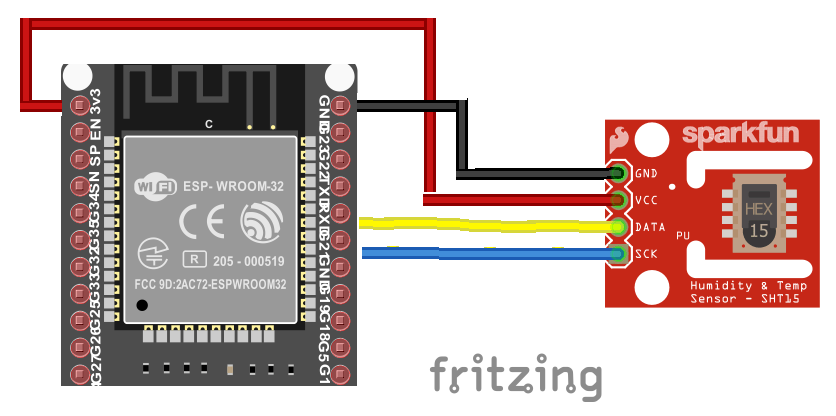
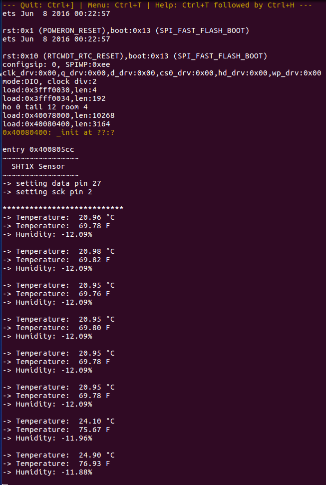

# SHT1X LIBRARY FOR ESP-IDF Programming
This is a C library for the SHT1X Temperature-Humidity sensor for esp-idf framework

This code is taken from: sht1x-library-Arduino and it was modified for the esp-idf framework https://github.com/sanket2994/sht1x-library-Arduino

 

## How to compile

    $ git clone https://github.com/danielTobon43/sht1x_esp32_idf_library.git
    $ idf.py build
    $ idf.py -p <port number> -b <baud frenq> flash monitor
     
     e.g. 
     idf.py build && idf.py -p /dev/ttyUSB0 -b 115200 flash monitor
     
     Output example:     
     ~~~~~~~~~~~~~~~~~
      SHT1X Sensor   
     ~~~~~~~~~~~~~~~~~
    -> reading data...
    -> Temperature:  615.65 °C 
    -> Temperature:  1140.13 F 
    -> Humidity: 12159.24% 
    
 ## How to include in your own project
 
    1.  copy sht1x.c in your src folder
    2.  copy sht1x.h in your include folder
    3.  set the sht1x.c in your CMakeLists.txt on your main folder
    
    e.g.
    
      set(srcs  "src/main.c" 
                "src/sht1x.c"
       )
       
       idf_component_register(SRCS ${srcs} INCLUDE_DIRS "." )
       
    4.  set the include directory on your top CMakeLists.txt on your root project
    
    e.g.
    
      include($ENV{IDF_PATH}/tools/cmake/project.cmake)    
      include_directories ("${CMAKE_SOURCE_DIR}/main/include")
      
    5.  set the include header on your main program
    
    e.g.
    
      #include "path-to-sht1x-header/sht1x.h"
      
   ## Example
    
      
   
    

     

